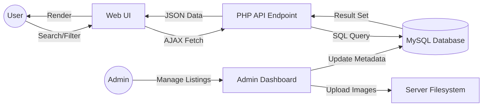
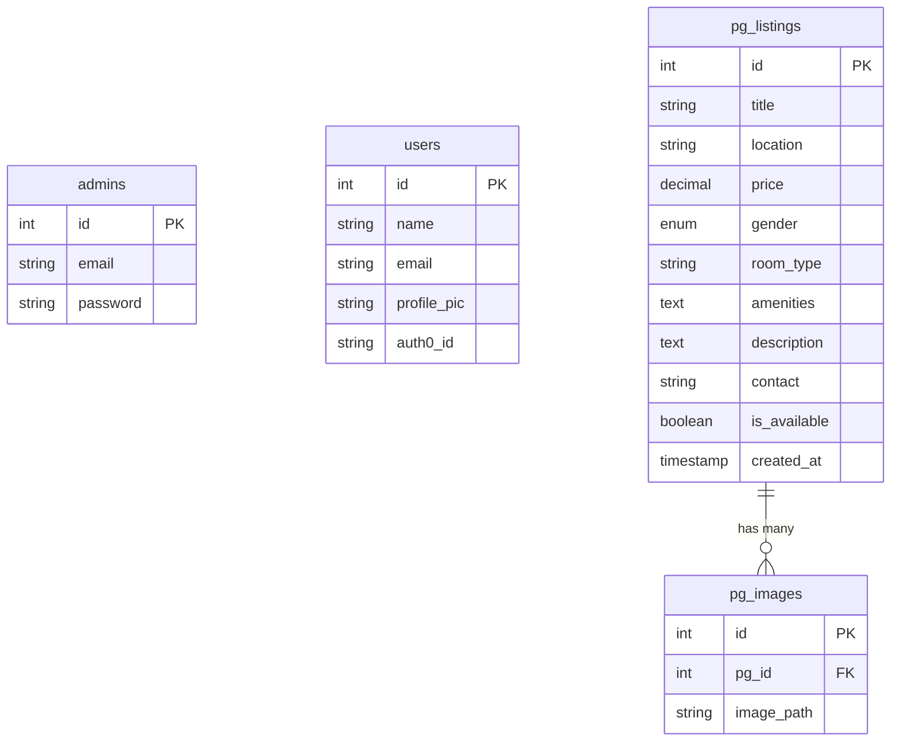

# 🏠 PG Connect - Premium PG Accommodation Platform

**PG Connect** is a full-stack, modern web application designed to bridge the gap between PG owners and students/professionals looking for comfortable, affordable, and secure accommodations. The platform features a premium user experience with live search, dynamic filtering, and a powerful admin dashboard for listing management.

---

## 📸 Visual Showcase

### 🔍 Explore Accommodations
| | |
|:---:|:---:|
|  |  |
|  | |

### 📖 Detailed Listings
| | |
|:---:|:---:|
|  |  |
|  | |

### 🛠️ Admin Management
| | |
|:---:|:---:|
|  |  |
|  |  |
|  |  |
|  | |

---

## ✨ Features

- **Dynamic Search**: Live search by location or PG name with instant results.
- **Advanced Filtering**: Filter by Price Range (Min/Max), Gender (Boys, Girls, Co-ed), and room types.
- **Rich Media**: Multi-image support for each listing with a premium gallery view.
- **Interactive UI**: Micro-animations for favorite buttons and smooth transitions.
- **User Authentication**: Integrated with Auth0 for secure user login.
- **Admin Dashboard**: Comprehensive CRUD operations for listings, including image management and availability toggles.
- **Mobile Responsive**: Fully optimized for all screen sizes.

---

## 🚀 Technology Stack

- **Frontend**: HTML5, CSS3 (Vanilla with modern design patterns), JavaScript (Fetch API, AJAX).
- **Backend**: PHP 7.4+ (Vanilla PHP for core logic).
- **Database**: MySQL (Relational data management).
- **Authentication**: Auth0 (User) & Session-based Secure Hash (Admin).
- **Icons**: FontAwesome 6.4.0.
- **Styling**: Glassmorphism, CSS Gradients, and Shadow tokens.

---

## 🏗️ High-Level Design (HLD)

The system follows a **Modular Client-Server Architecture**:

1.  **Presentation Layer**: Built using Semantic HTML and Vanilla CSS. It uses AJAX (Fetch) to communicate with the backend for real-time searching without page reloads.
2.  **Application Logic Layer**: PHP scripts handle request processing, session management, and business rules.
    - `index.php`: Main entry point with search logic.
    - `api/get_pgs.php`: JSON endpoint for dynamic listings.
    - `admin/`: Secure zone for management.
3.  **Data Access Layer**: Uses PHP Data Objects (PDO) for secure, prepared SQL queries to prevent SQL injection.
4.  **Storage**: 
    - **MySQL**: Stores metadata (prices, locations, user info).
    - **Local Filesystem**: Stores uploaded images in the `uploads/` directory.

### Data Flow Diagram


---

## 📊 Database Schema

The database is structured to handle relational data efficiently with cascading deletes for image management.



### Table Definitions:
- **admins**: Stores administrative credentials.
- **users**: Syncs user data from Auth0.
- **pg_listings**: Core data for accommodations.
- **pg_images**: Links multiple image paths to a single listing.

---

## 🛠️ Installation & Setup

1.  **Clone the Repository**:
    ```bash
    git clone https://github.com/JyotiGupta-alt/PG-Connect.git
    ```
2.  **Database Configuration**:
    - Import `schema.sql` into your MySQL server.
    - Update `includes/db.php` or `.env` with your database credentials (`host`, `dbname`, `username`, `password`).
3.  **Configure Auth0**:
    - Add your Auth0 Domain, Client ID, and Client Secret to the configuration.
4.  **Run Locally**:
    - Use XAMPP, WAMP, or any PHP server.
    - Ensure the `uploads/` directory is writable.

---

© 2026 PG Connect | Designed for Excellence.
